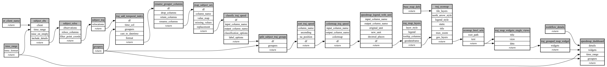

```
# AUTOGENERATED BY ECOSCOPE-WORKFLOWS; see fingerprint in README.md for details

```

```yaml
# fingerprint:
artifacts_sha256_basic: d4ebb4d2068a6a4e59b5414ad53462822f703fa7cb8cc8c2ba784ef0d3af92a9
artifacts_sha256_strict: a389cc12b21e3c64f4cebdd652a52b807a6c66d3a142cf98410a8c0c47170640
installed_requirements:
- channel: file:///tmp/ecoscope-workflows/release/artifacts/
  name: ecoscope-workflows-core
  version: {version: ==0.0.71}
- channel: file:///tmp/ecoscope-workflows/release/artifacts/
  name: ecoscope-workflows-ext-ecoscope
  version: {version: ==0.0.71}
params_sha256: c08935ccc72918a91db2958f70e0d21ac8cde05cd28f00b7c283989b67242807
spec_sha256: d4446f1057988033d7db04fd61a6b4aed75657fb6c4c36f996dc58be00931fc4

```

# ecoscope-workflows-speedmap-workflow


