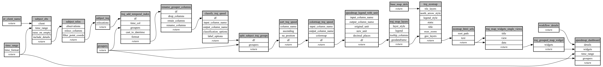

```
# AUTOGENERATED BY ECOSCOPE-WORKFLOWS; see fingerprint in README.md for details

```

```yaml
# fingerprint:
artifacts_sha256_basic: 8ff002ddc2fc0c634f9e530f44dcd9c9a673831a3862791736823f241e483ddf
artifacts_sha256_strict: ff1389af5db3d311285513feb7e49d32f50fae876bf4e194c0221fcb0cbbd664
installed_requirements:
- channel: file:///tmp/ecoscope-workflows/release/artifacts/
  name: ecoscope-workflows-core
  version: {version: ==0.0.71}
- channel: file:///tmp/ecoscope-workflows/release/artifacts/
  name: ecoscope-workflows-ext-ecoscope
  version: {version: ==0.0.71}
params_sha256: c08935ccc72918a91db2958f70e0d21ac8cde05cd28f00b7c283989b67242807
spec_sha256: 3d316cded5814f238d97b2e7224e3937734e69a75d37ae80d9eb9120e9984269

```

# ecoscope-workflows-speedmap-workflow


